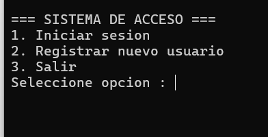
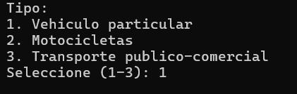
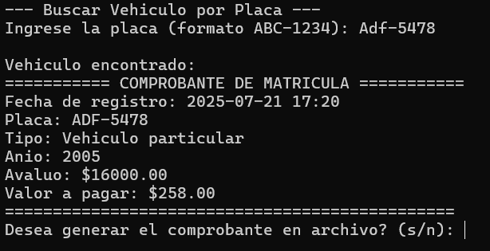

# Proyecto SIVEM
Objetivo: Diseñar e implementar un sistema de gestión vehicular que permita registrar vehículos, calcular el monto correspondiente al pago de la matrícula según normativa vigente y registrar/verificar el cumplimiento de las tres revisiones técnicas obligatorias anuales. El sistema debe ofrecer funcionalidades accesibles tanto para los propietarios de vehículos como para el personal encargado de su control.
# Funcionalidades 
Entre sus funciones se encuentra:
- Registrar vehículos matriculados.
- Calcular automáticamente el monto correspondiente al pago de la matrícula según la normativa vigente.
- Generar un archivo del comprobante de la matricula
- Búsqueda de vehículos por placa
# Intrucciones 
Para poder compilar el programa es necesario incluir las librerías junto con las cabeceras que contienen las funciones que se utilizan para la ejecución del programa, también se debe considerar que el código fuente esta hecho especifícamente para el lenguaje de programación C. Primero se debe extraer los archivos de la carpeta comprimida, luego abrir zinjai y despues a crear un proyecto, finalmente elegir la carpeta donde se encuentran los archivos del programa.
# Requisitos 
- Lenguaje: C
- Sistema operativo: Windows / Linux
- IDE: Zinjai 
- Librerías estándar del lenguaje C
### Archivos principales del proyecto
- main.c
- login.c 
- limpiar.c
- matricula.c
- menu.c
- registro.c
- revision.c
- main.h
- login.h 
- limpiar.h
- matricula.h
- menu.h
- registro.h
- revision.h
# Integrantes
| Danny Lanchimba |
Sebastian Llugsa |
Jonathan Pincay |
### Interfaz del registro de vehículos

### Vehiculos registrados

### Seleccion de tipo de vehiculo

### Busqueda de vehiculos

